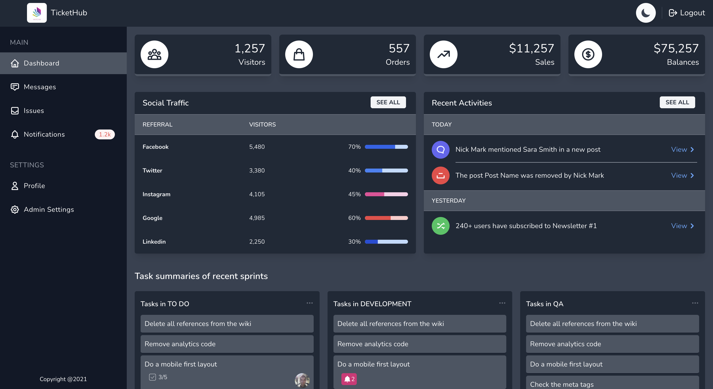
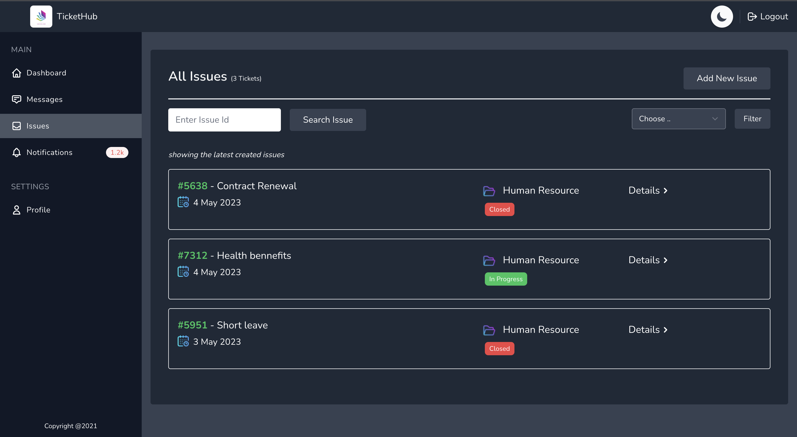
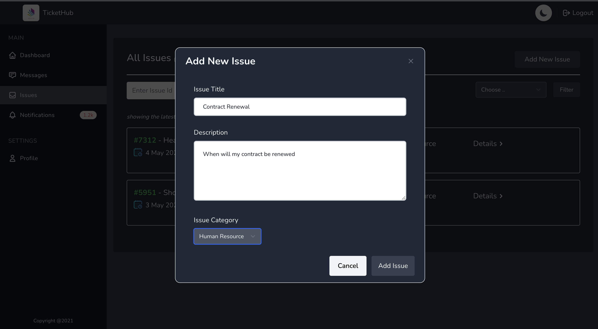
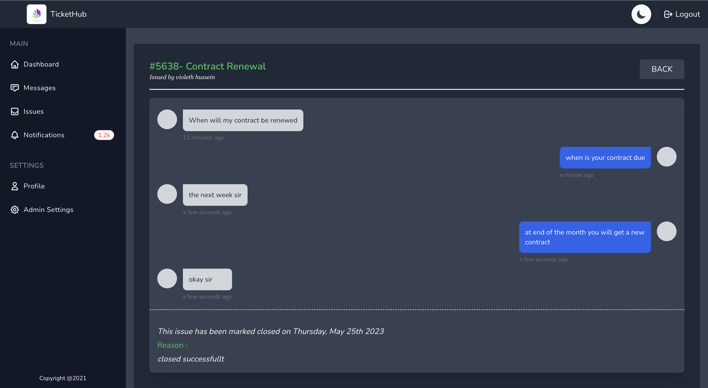
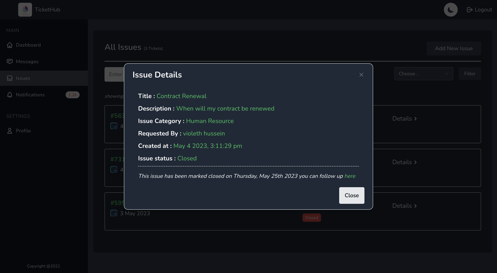
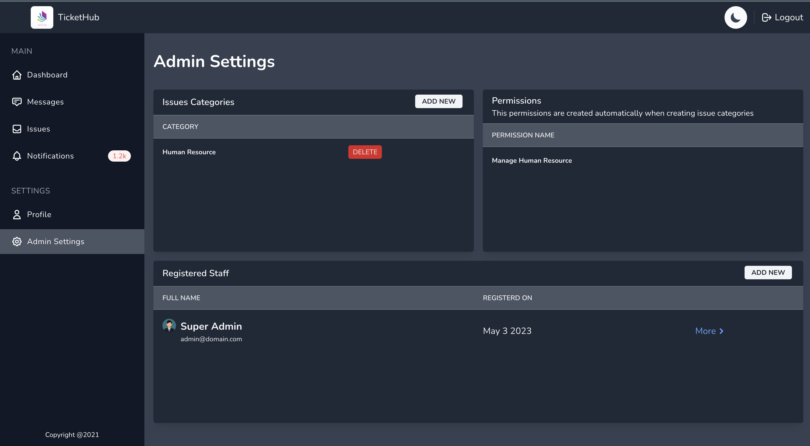

# TicketHub

This is a web based platform which helps orgarnizations to create issues for their clients to create issues regarding diffrent matters.

End users which can be clients or any end user are required to be registered and can start to raise issues depending on which category.Then the customer service will help them and once resolved can mark the issue as resolved

This project is made of laravel and mysql in the back-end and front-end with vue.js and tailwind css

## Screenshots
<div style="display:flex;">



</div>

<div style="display:flex; margin-top:1.5rem;">



</div>

<div style="display:flex; margin-top:1.5rem;">



</div>


## Installation
This project requires

- Php 8.2 
- Composer 2
- MySQL 8 +

## Guildelines 

- Clone the repositiory to your mashine and run to install project dependencies
```
composer install
```
- Set up your .env file and add your database credentials then run migrate command and database seeder
 Run migrations
```
php artisan migrate //runs the migrate command

php artisan db:seed  //runs the seeder command
```
The seeder command will create a new user which for this application will be a super administrator which will have the credentials of
Email : admin@domain.com Password: TicketHub@2023. You can later change this once your logged in

Users in this project are grouped into two
- Normal users can be client,employees or any targeted end user
- Customer service team which includes the super administrator and his team


### Normal Users
- Can create issues depending on the categories and they will be assigned a customer service personnel
- They can chat with the customer service team
- Document attachments  (Comming soon ❌)


### Customer Service
This include the super administrator and his team

Super Administrator features
- Can create categories of diffrent types of issues
- Can Add new users which will serve in his team as customer service and assign them permissions to respond to diffrent category of tickets. (Coming soon ❌)
- Admin dashboard when can observe 
  - Total no of issues
  - Open issues
  - Closed issues
  - Which type of issues has many request
  - Registred customer service users

Customer service team users feautures
- Can respond to the types of issues given permission to
- Dashboard which can observe
 - Total no of issues for that category
 - Issues closed
 - Issues open

 ## Working With Live Chats
Messages sent in the issues chat can be configured to be live(received to the end user in realtime) to allow realtime messages in issue chat navigate to the config directory inside the app.php change the live chat configuration to true.
By default live chats are disabled

### Upcoming feautures
- Dashboard
- Document attachment in chats


## Licence 
This project is licensed under the [MIT License](LICENSE.txt), which allows users to freely use, modify, and distribute the code for both commercial and non-commercial purposes, without payment of royalties or other fees.

Under the MIT License, users are permitted to:

- Use the code for personal or commercial purposes.
- Modify the code to suit their needs.
- Distribute the code in both original and modified form.

However, users are required to include a copy of the MIT License in all copies or substantial portions of the software, and to provide attribution to the original author(s) of the code. The license also includes a disclaimer of liability, stating that the software is provided "as is" without any warranties or guarantees.
